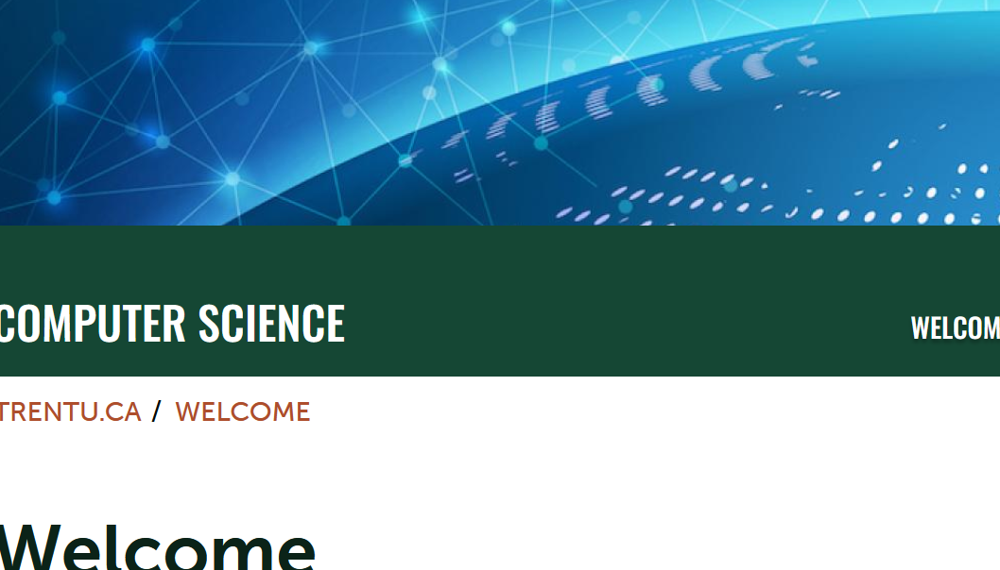

# Workshop 4

By: Aaron Sarjeant

## Emphasis

In only 60 years, *the field of computing and information systems* has redefined the traditional ways of business, education, government, and entertainment.  Virtually every _organization and every field of study rely on computers and related technologies to_ succeed in the Information Age.  Even our everyday vocabulary embraces words like The Internet, email, Google, Facebook, YouTube, MP3, ATM, and Wii.

## Strong

The **study of computing and information systems is central** to our understanding of how the world processes, manages and __communicates information using digital__ technologies.  As a student, you learn to build and use computing and information systems.  You learn to see things from a broader systems perspective and to develop integrated solutions that meet the needs of your users.  And you learn to appreciate the far-reaching cultural, ethical, and legal impact of digital systems.

## lists

### unorderedlists

- list item 1
- list item 2
  - subitem 1
  - subitem 2
- listitem 3

### ordered lists

1. first
2. second
   1. subitem 1
   2. subitem 2
3. third
  
## images



## hyperlinks

[COIS Department Website](https://www.trentu.ca/cois/)

## Including Code

### Inline Code

 in HTML the `` tag is used to display pictures.

### Code Fences

```html
<nav>
        <ul>
          <li><a href="index.html">Home</a></li>
          <li><a href="grid.html">Grid</a></li>
          <li><a href="https://trentu.ca">Trent</a></li>
          <li><a href="https://loki.trentu.ca">Loki</a></li>
        </ul>
      </nav>

```

```css
body {
  font-family: system-ui, -apple-system, BlinkMacSystemFont, "Segoe UI", Roboto,
    Oxygen, Ubuntu, Cantarell, "Open Sans", "Helvetica Neue", sans-serif;
  height: 100vh;
  display: flex;
  flex-direction: column;
}

```